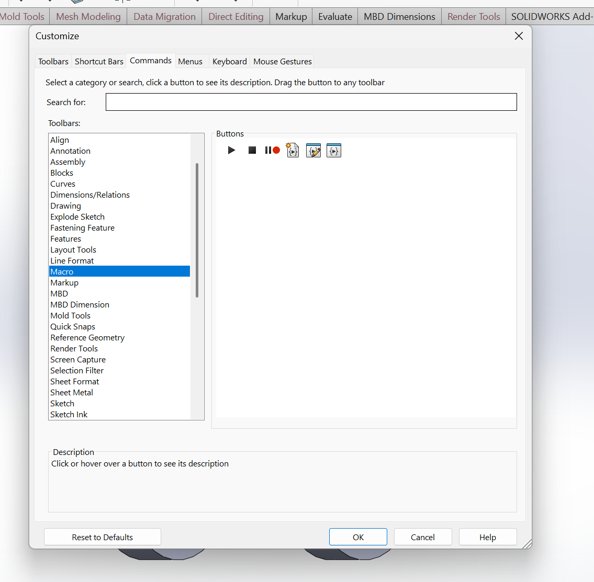

# AMR-CAD-Tools
CAD Tools for AMR Project

#How to install macro into solidworks

1. Open solidworks user customizations

2. Go to commands->macro

3. Drag a New Macro Button from the commands window onto the top ribbon. Features is recommened but any works.

4. Set the Macro Path. Always keep the macros inside of this repository to ensure they stay up to date. Optionally set the image. Click okay.

5. Clicking the added button should trigger the macro.

